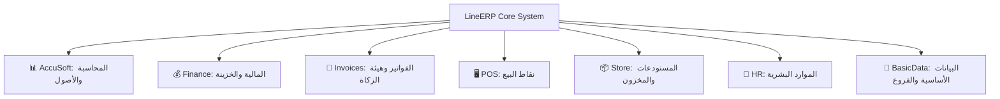

<div align="center">

# 🚀 LineERP — Enterprise Resource Planning System

**نظام متكامل وقوي لإدارة موارد المؤسسات مبني بأحدث تقنيات Laravel و Livewire وفق المعايير السحابية والموديلية (Modular Architecture)**

[](https://laravel.com)
[](https://livewire.laravel.com)
[](https://php.net)
[](https://zatca.gov.sa)
[](https://web.dev/progressive-web-apps/)
[](LICENSE)

</div>

---

## 📖 نظرة عامة (About LineERP)

**LineERP** هو نظام متطور ومتكامل لإدارة موارد الشركات والمؤسسات (ERP)، تم بناؤه بهندسة برمجية قائمة على الوحدات المستقلة (**Modular Architecture via `nwidart/laravel-modules`**). يتيح النظام إدارة العمليات التجارية، المالية، المحاسبية، المخزنية، ونقاط البيع بدقة عالية وسلاسة فائقة، مع دعم كامل للفوترة الإلكترونية (هيئة الزكاة والضريبة والجمارك - **ZATCA**) وعزل البيانات على مستوى الفروع المتعددة (**Branch Scoping**).

---

## 🌟 الوحدات الأساسية والميزات (Core Modules & Features)



### 1️⃣ وحدة المحاسبة والأصول (`AccuSoft`)
* **شجرة الحسابات (Chart of Accounts):** هيكلية محاسبية مرنة ومتعددة المستويات.
* **قيود اليومية التلقائية واليدوية (Journal Entries):** ترحيل آلي لكافة حركات المبيعات، المشتريات، المخزون، والرواتب.
* **إدارة الأصول الثابتة (Fixed Assets):** تسجيل الأصول، تتبع مواقعها، وقيمتها الدفترية.
* **إهلاك الأصول الآلي (Depreciation Schedules & Runs):** معالجة وتوليد جداول الإهلاك الدورية تلقائياً.
* **تتبع اضمحلال الأصول والعمليات المالية (Asset Impairment & Transactions).**

### 2️⃣ وحدة الفواتير والمشتريات والفوترة الإلكترونية (`Invoices`)
* **متوافق مع هيئة الزكاة والضريبة والجمارك (ZATCA Phase 2):** إنشاء وتوقيع الفواتير الإلكترونية وتوليد رمز الاستجابة السريعة (QR Code) وفق المعايير المعتمدة.
* **فواتير المبيعات والمشتريات (Sales & Purchase Invoices):** دورة مستندية متكاملة مع ضريبة القيمة المضافة (VAT).
* **عروض الأسعار وأوامر الشراء (Quotations & Purchase Orders):** تحويل عروض الأسعار إلى فواتير بضغطة زر.
* **نظام المسودات والاعتماد (Draft & Approval Workflow):** حوكمة العمليات المالية قبل التأثير على المخزون أو القيود المحاسبية.
* **مردودات المبيعات والمشتريات (Debit & Credit Notes).**

### 3️⃣ وحدة نقاط البيع (`POS`)
* **إدارة أجهزة ونقاط البيع (POS Devices & Terminals):** ربط أجهزة متعددة وتعيينها للفروع.
* **جلسات الكاشير والورديات (Cashier Sessions):** فتح وإغلاق الجلسات، جرد النقدية، وتدقيق الفروقات (Session Auditing).
* **طرق دفع متعددة (Split & Multi Payment Methods):** نقدي، مدى، بطاقات ائتمانية، آجل.
* **أمان إضافي:** تسجيل دخول الكاشير عبر رمز PIN السريع (`PosDeviceUserPin`).

### 4️⃣ وحدة المستودعات والمخزون (`Store`)
* **إدارة المستودعات المتعددة:** تتبع الكميات ومواقع التخزين بدقة.
* **التحويل المباشر بين الفروع والمستودعات (Direct Stock Transfers).**
* **إذون الاستلام والصرف المخزني (Receiving & Issuing Vouchers).**
* **تسويات الجرد المخزني (Stock Adjustments & Settlements):** مطابقة الجرد الفعلي مع الدفتري.
* **إتلاف المخزون (Damaged Stock):** معالجة الهالك والتالف محاسبياً ومخزنياً.
* **حجز البضائع (Stock Reservations):** تتبع الكميات المحجوزة للطلبات.
* **دعم الباركود والوحدات المتعددة لكل صنف.**

### 5️⃣ وحدة المالية والخزينة (`Finance`)
* **إدارة الخزائن النقدية (Safes) والحسابات البنكية (Bank Accounts).**
* **سندات القبض والصرف (Receipt & Payment Vouchers - FncBonds).**
* **تتبع السيولة وحركة التدفقات النقدية (Cash Flow Tracking).**

### 6️⃣ وحدة الموارد البشرية (`HR`)
* **ملفات الموظفين الشاملة:** الهويات، الوثائق، العقود، والبيانات البنكية.
* **إدارة الحضور والانصراف والورديات (Attendance & Shifts).**
* **طلبات الإجازات ومسارات الموافقة (Leave Management).**
* **مسيرات الرواتب والبدلات والخصومات (Payroll Management).**

### 7️⃣ وحدة البيانات الأساسية وتعدد الفروع (`BasicData`)
* **عزل وتخصيص البيانات حسب الفرع (`Branch Scoping`):** حماية خصوصية بيانات الفروع واستقلالية التقارير.
* **الشركات والفروع والمنظمات والمشاريع.**
* **إدارة المطابخ ونقاط الخدمة (Kitchens & Service Points).**
* **المناطق، المدن، والعملات المتعددة.**

---

## 🔒 الأمان والأداء (Security & Infrastructure)

- **إدارة الصلاحيات والأدوار:** صلاحيات دقيقة ومبنية عبر `spatie/laravel-permission`.
- **سجل التدقيق والأنشطة:** تسجيل تفصيلي لعمليات النظام عبر `spatie/laravel-activitylog`.
- **سجل الإشعارات:** إدارة وتوثيق وصول الإشعارات عبر `spatie/laravel-notification-log`.
- **تطبيق ويب تقدمي (PWA):** تجربة استخدام وتثبيت سريعة تدعم العمل دون انقطاع عبر `silviolleite/laravelpwa`.
- **تصدير وطباعة احترافية:** دعم كامل لتقارير PDF باللغة العربية عبر `mpdf/mpdf` وملفات Excel عبر `maatwebsite/excel`.
- **دعم التقويم الهجري والميلادي:** عبر حزمة `mohamedsabil83/laravel-hijrian`.
- **مراقبة الأخطاء:** مدمج مع `Sentry` لتتبع واستكشاف الأخطاء بشكل فوري.

---

## 🛠️ التقنيات المستخدمة (Tech Stack)

| المجال | التقنية |
|---|---|
| **Framework** | [Laravel 10.x](https://laravel.com) |
| **Language** | PHP >= 8.1 / 8.2 |
| **Reactive UI** | [Livewire 3.x](https://livewire.laravel.com) + Alpine.js |
| **UI & Admin Theme** | AdminLTE + Bootstrap |
| **Modular System** | [`nwidart/laravel-modules`](https://github.com/nWidart/laravel-modules) |
| **Database** | MySQL 5.7+ / 8.0+ / MariaDB |
| **Asset Bundler** | [Vite](https://vitejs.dev/) |
| **Auth & Security** | Laravel Sanctum + Spatie Permission |
| **E-Invoicing** | ZATCA Integration Package (`salla/zatca`) |
| **API Documentation** | L5 Swagger (OpenAPI) |

---

## ⚙️ التثبيت والتشغيل (Installation Guide)

### المتطلبات الأساسية (Prerequisites)
* **PHP** >= 8.1 (مع امتدادات: `bcmath`, `ctype`, `fileinfo`, `json`, `mbstring`, `openssl`, `pdo_mysql`, `tokenizer`, `xml`, `gd`)
* **Composer** >= 2.x
* **Node.js** >= 18.x & **NPM**
* **MySQL** >= 5.7 أو **MariaDB** >= 10.3

### خطوات التثبيت (Step-by-Step)

#### 1️⃣ استنساخ المستودع (Clone Repository)
```bash
git clone https://github.com/dhiaamostafa46/lineERP.git
cd lineERP
```

#### 2️⃣ تثبيت حزم PHP و Node
```bash
composer install
npm install
```

#### 3️⃣ إعداد ملف البيئة (Environment Configuration)
```bash
cp .env.example .env
php artisan key:generate
```

قم بضبط إعدادات قاعدة البيانات في ملف `.env`:
```env
APP_NAME=LineERP
APP_URL=http://localhost:8000

DB_CONNECTION=mysql
DB_HOST=127.0.0.1
DB_PORT=3306
DB_DATABASE=line_erp
DB_USERNAME=root
DB_PASSWORD=
```

#### 4️⃣ ترحيل قواعد البيانات وتغذيتها بالبيانات الأولية
```bash
php artisan migrate --seed
```

#### 5️⃣ ربط التخزين وتوليد الأصول
```bash
php artisan storage:link
npm run build
```

#### 6️⃣ تشغيل خادم التطوير
```bash
# تشغيل خادم الواجهة الأمامية (Vite)
npm run dev

# في نافذة طرفية أخرى: تشغيل خادم Laravel
php artisan serve
```

افتح المتصفح وتوجه إلى: `http://localhost:8000`

---

## 💻 أوامر مفيدة أثناء التطوير (Useful Artisan Commands)

```bash
# مسح وتحديث الذاكرة المؤقتة بالكامل
php artisan optimize:clear

# تشغيل ترحيل الجداول الخاصة بالوحدات النمطية
php artisan module:migrate
php artisan module:seed

# تشغيل الاختبارات المؤتمتة
php artisan test

# تنسيق الكود وفق معايير Laravel الرسمية
vendor/bin/pint
```

---

## 📄 الترخيص (License)

هذا المشروع مرخص تحت رخصة **[MIT License](LICENSE)**.
